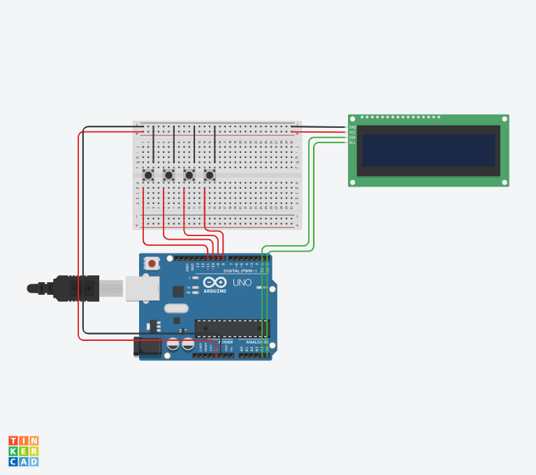

# Electronic Voting Machine (EVM)

## Overview

This project is an Arduino-based Electronic Voting Machine (EVM) developed as part of an embedded systems project. The system allows a user to select a candidate and confirm the vote using a dedicated Enter button.

This repository documents the development of the project stage by stage.

---

## Current Stage

### Stage 1 - Basic Candidate Selection and Vote Confirmation

### Implemented Features

* Candidate A, B, and C selection using push buttons
* 16x2 I2C LCD display interface
* Vote confirmation using Enter button
* 10-second confirmation timeout
* Vote acknowledgement message
* Automatic return to home screen after voting

---

## Components Used

* Arduino Uno
* 16x2 I2C LCD Display
* Push Buttons (A, B, C, Enter)
* Breadboard
* Jumper Wires

---

## Pin Configuration

| Component          | Arduino Pin |
| ------------------ | ----------- |
| Candidate A Button | D11         |
| Candidate B Button | D10         |
| Candidate C Button | D9          |
| Enter Button       | D8          |
| LCD SDA            | A4          |
| LCD SCL            | A5          |

---

## Working Principle

1. System displays:

   ```
   SELECT
   CANDIDATE
   ```

2. User presses Candidate A, B, or C button.

3. LCD displays:

   ```
   CANDIDATE X
   Press Enter
   ```

4. User must press Enter within 10 seconds.

5. If Enter is pressed:

   * Vote is confirmed.
   * LCD displays:

     ```
     VOTED TO X
     ```

6. If Enter is not pressed within 10 seconds:

   * Vote is cancelled.
   * LCD displays:

     ```
     TIME OUT
     ```

7. System automatically returns to the home screen.

---

## Development Timeline

* [x] Stage 1 - Basic Candidate Selection and Confirmation
* [ ] Stage 2 - LCD Improvements
* [ ] Stage 3 - Vote Counting
* [ ] Stage 4 - Admin Functions
* [ ] Stage 5 - EEPROM Storage
* [ ] Final Version

---

## Project Structure

```text
EVM-Project/
│
├── README.md
│
├── src/
│   └── EVM.ino
│
└── tinkercad_stages/
    └── Stage_1.png
```

---

## Stage 1 Circuit



---

## Current Status

The repository currently contains the first working prototype of the Electronic Voting Machine. Future stages will include vote counting, admin controls, EEPROM storage, and additional security features.
