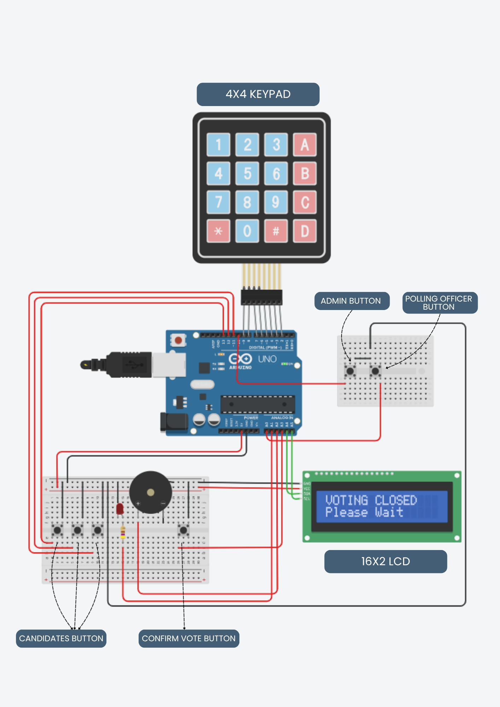
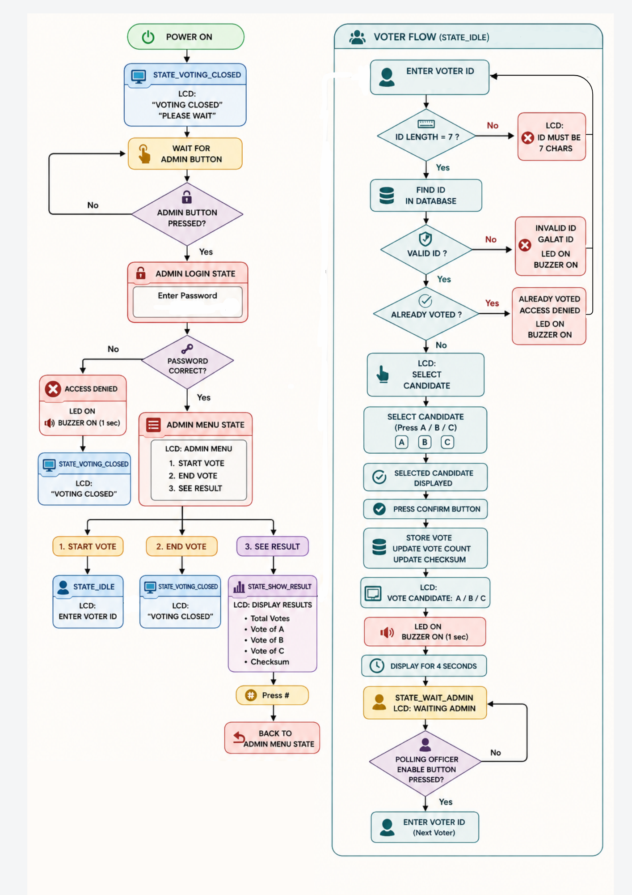

# Electronic Voting Machine (EVM)

##  📖 Overview

This project implements a secure Arduino-based Electronic Voting Machine (EVM) with voter authentication, administrative control, persistent vote storage, checksum-based integrity verification, and data corruption detection. The system is designed to simulate a reliable voting environment while ensuring vote security and preventing unauthorized access.

---

## ✨ Features

* Voter ID Authentication
* Duplicate Vote Prevention
* Candidate Selection and Confirmation
* Administrative Authentication
* Voting Start and Stop Control
* Vote Counting
* Result Display
* EEPROM-Based Vote Storage
* Power-Loss Data Recovery
* Checksum-Based Data Integrity Verification
* Data Corruption Detection
* Election Reset Functionality
* LCD-Based User Interface
* LED Status Indication
* Buzzer Feedback System
* System Lock After Multiple Failed Admin Attempts

---

## 🔧 Components Used

* Arduino Uno
* 4×4 Matrix Keypad
* 16×2 I2C LCD Display
* Push Buttons
* LEDs
* Buzzer
* EEPROM (Internal Arduino EEPROM)
* Breadboard
* Jumper Wires

---

## 📍 Pin Configuration

| Component | Type | Arduino Pin Connection |
|------------|------------|------------|
| 4×4 Matrix Keypad | Input | D2, D3, D4, D5, D6, D7, D8, D9 |
| Admin Button | Input | A0 |
| Candidate A Button | Input | D13 |
| Candidate B Button | Input | D12 |
| Candidate C Button | Input | D11 |
| Polling Officer Enable Button | Input | D10 |
| Confirm Vote Button | Input | A3 |
| 16×2 I2C LCD | Output | SDA → A4, SCL → A5 |
| LED Indicator | Output | A1 |
| Active Buzzer | Output | A2 |
| Arduino Uno | Processing Unit | Central Controller |
| EEPROM (Internal to ATmega328P) | Storage | Internal Memory (No External Pins Required) |

---

## 📥 EEPROM Memory Map

| EEPROM Address | Purpose |
|----------------|---------|
| 0–1 | Magic Bytes (Initialization Check) |
| 2–3 | Candidate A Vote Count |
| 4–5 | Candidate B Vote Count |
| 6–7 | Candidate C Vote Count |
| 8–9 | Total Vote Count |
| 10–19 | Voter Status Database |
| 20 | Election Open Status |
| 21 | System Lock Status |
| 22–25 | Checksum Storage |

---

## ⚙️ Working Principle

1. Administrator authenticates using the admin password.
2. Voting is enabled through the admin menu.
3. Voters enter their voter ID using the keypad.
4. The system validates the voter ID against the stored database.
5. Invalid or previously used IDs are rejected.
6. Valid voters select a candidate and confirm their vote.
7. Vote counts and voter status are immediately stored in EEPROM.
8. A checksum is generated and stored to verify data integrity.
9. Results can be viewed through the admin menu.
10. During startup, stored data is verified using the checksum.
11. If any manipulation is detected, the system enters a protected state requiring administrator intervention.

---

##  🔌Circuit Diagram

---

##  📊 Flowchart

---

## 🖼️ Hardware Implementation

---

## 🎥 Project Demonstration

Video Demonstration:

[Watch Demo Video](https://drive.google.com/file/d/1aVTEY-IWQvPJfhJ_ltFIEVizVbOxSBQ3/view?usp=drive_link)

---

## 🚀 Future Improvements

* Fingerprint-Based Voter Authentication
* Encrypted Vote Storage
* SD Card Logging
* Biometric Verification
* Wireless Result Transmission

---

## Author

Tushar Kanti Sahariah
